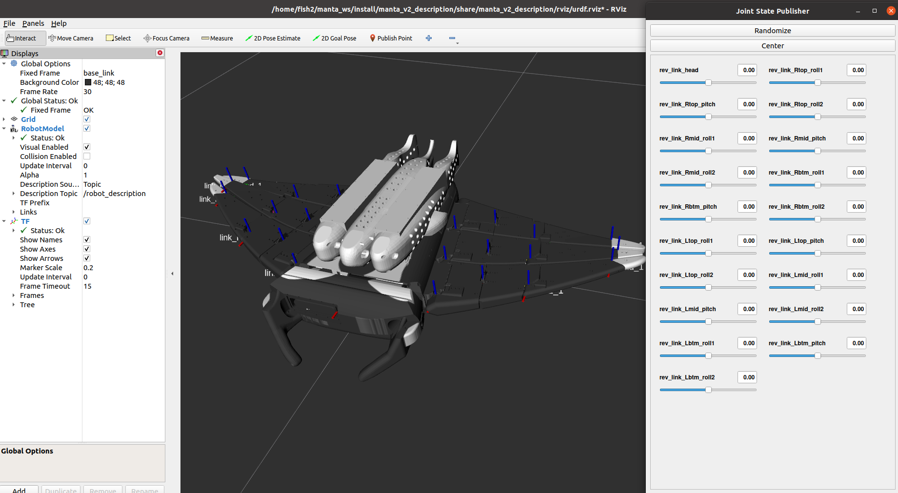

# manta_v2_bringup
This package contains launch files for loading manta_v2 in ROS2 and Rviz2 environments.

# Install
If you have not installed the 'joint-state-publisher-gui' package, run the following command to install the joint-state-publisher-gui package.

```
sudo apt-get install ros-foxy-joint-state-publisher-gui
```

# Example
This is an example of using the 'joint_state_publisher_gui' node and the 'manta_v2_description' package to check the configuration of manta_v2.

```
source ~/robot_ws/install/setup.bash
ros2 launch manta_v2_bringup manta_bringup.launch.py
```

You can check the posture of manta_v2 by directly entering each joint angle value or using the slider.



(* If you want to check the coordinate system of a specific link as shown in the picture, activate the Show Axes option in rviz2.)