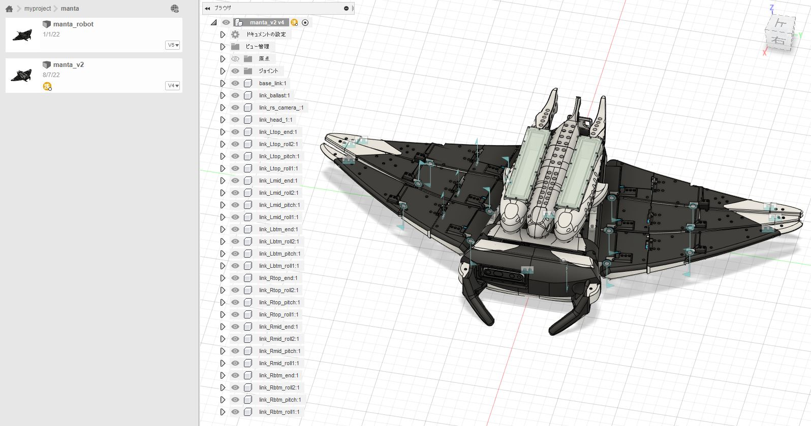

# manta_v2_description
This package contains model files (urdf, stl) for loading manta_v2 in ROS2 and Rviz2 environments.



To see the coordinate system and position of each link in manta_v2, you need to clone the manta_v2_bringup package.

# Install
If you have not installed the 'joint-state-publisher-gui' package, run the following command to install the joint-state-publisher-gui package.

```
sudo apt-get install ros-foxy-joint-state-publisher-gui
```