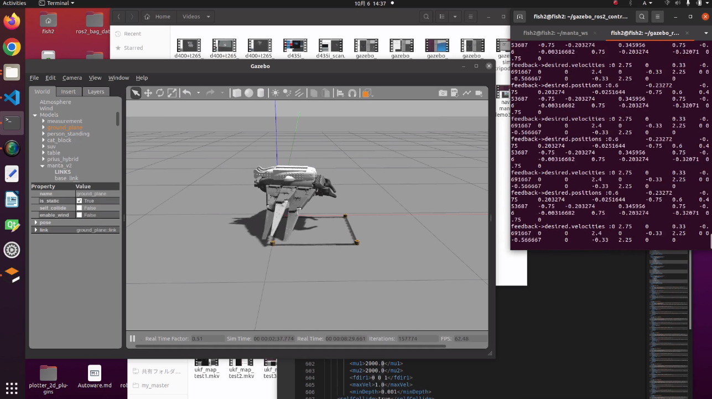

# manta_v2_gazebo_ros2_control
This package simulates manta_v2 with Gazebo

C++ examples of using MoveIt 2 for planning motions that are executed inside Gazebo simulation environment. These examples make use of ros2_control via gazebo_ros2_control.



## Examples
### Gazebo motion Simulation
In the first shell
```
ros2 launch manta_v2_gazebo_ros2_control trajectory_controller.launch.py
```
In the second shell
```
ros2 run manta_v2_gazebo_ros2_control tripod_motion
```

The motions that can be simulated with Gazebo are as follows.
- example_position
- tripod_rotate
- quadruped_pace
- quadruped_torotto
- quadruped_torotto_rear
- quadruped_torotto_rotate
- tripod_init
- tripod_motion
- tripod_rear
- wing_init
- wing_motion

### Gazebo and MoveIt2 Simulation
In the first shell
```
ros2 launch manta_v2_gazebo_ros2_control move_group_controller.launch.py
```
In the second shell
```
ros2 launch manta_v2_moveit_config moveit_demo.launch.py
```