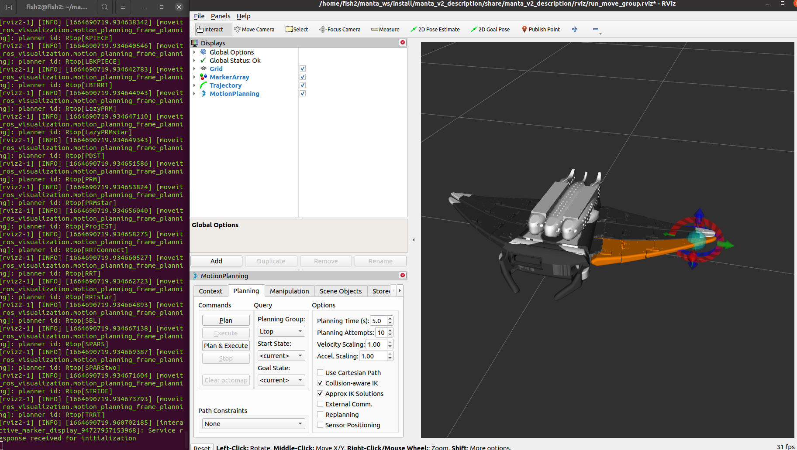

# manta_v2_moveit_config
This package contains manta_v2 configuration files (yaml, srdf) to use MoveIt2 package in ROS2 environment.

# Install
If you have not installed the following packages, run the following command to install the packages.

```
sudo apt install ros-$ROS_DISTRO-robot-state-publisher
sudo apt-get install ros-$ROS_DISTRO-ros2-control*
sudo apt-get install ros-$ROS_DISTRO-moveit*
```

# Run MoveIt
## Without a robot

```
ros2 launch manta_v2_moveit_config moveit_demo.launch.py
```

Once launching the demo, you should see the robot in MoveIt2! GUI like this:



## On a real robot
First, connect the robot and PC with a tether cable and connect to Jetson Nano on the robot side by SSH.

```
ssh jetson@192.168.13.26
```

(* default IP of Jetson Nano is 192.168.13.26)

And, run the control launch file.
```
ros2 launch manta_v2_controller robot_control.launch.py
```

In addition, in the second shell on the robot side(Jetson Nano), run the servo node.
```
ros2 run manta_v2_controller servo_node
```

Second, run the moveit demo launch file(Laptop PC).
```
ros2 launch manta_v2_moveit_config moveit_demo.launch.py
```