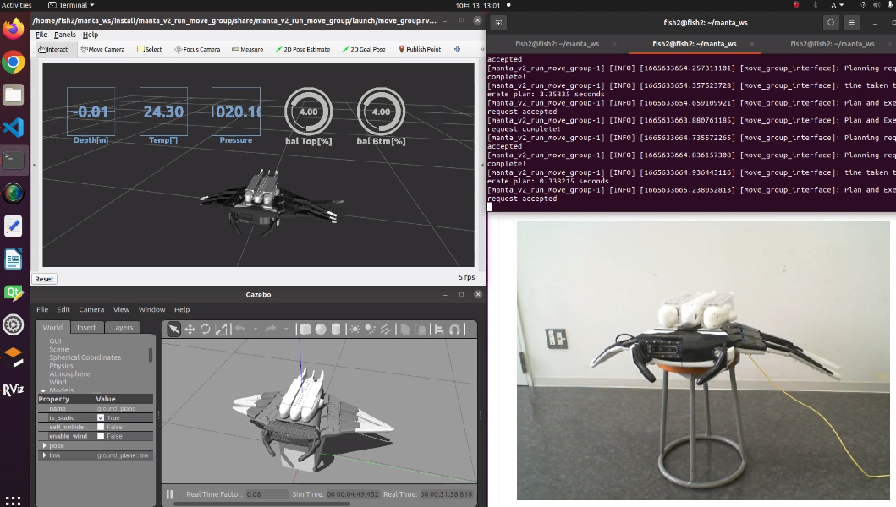

# manta_v2_run_move_group
This package for moving manta_v2 using Move Group C++ Interface.



# Install
If you have not installed the following packages, run the following command to install the packages.

```
sudo apt install ros-$ROS_DISTRO-robot-state-publisher
sudo apt-get install ros-$ROS_DISTRO-ros2-control*
sudo apt-get install ros-$ROS_DISTRO-moveit*
```

# Run Move Group demo
## Without a robot
In the first shell, run the move group launch file:
```
ros2 launch manta_v2_run_move_group move_group.launch.py
```

In the second shell, run the move group interface launch file:
```
ros2 launch cobotta_run_move_group move_group_interface.launch.py
```

## On a real robot
First, connect the robot and PC with a tether cable and connect to Jetson Nano on the robot side by SSH.

```
ssh jetson@192.168.13.26
```

(* default IP of Jetson Nano is 192.168.13.26)

And, run the control launch file.
```
ros2 launch manta_v2_controller robot_control.launch.py
```

In addition, in the second shell on the robot side(Jetson Nano), run the servo node.
```
ros2 run manta_v2_controller servo_node
```

Second, run the move group launch file(Laptop PC side).
```
ros2 launch manta_v2_run_move_group move_group.launch.py
```

Another shell, run the move group interface launch file:
```
ros2 launch cobotta_run_move_group move_group_interface.launch.py
```